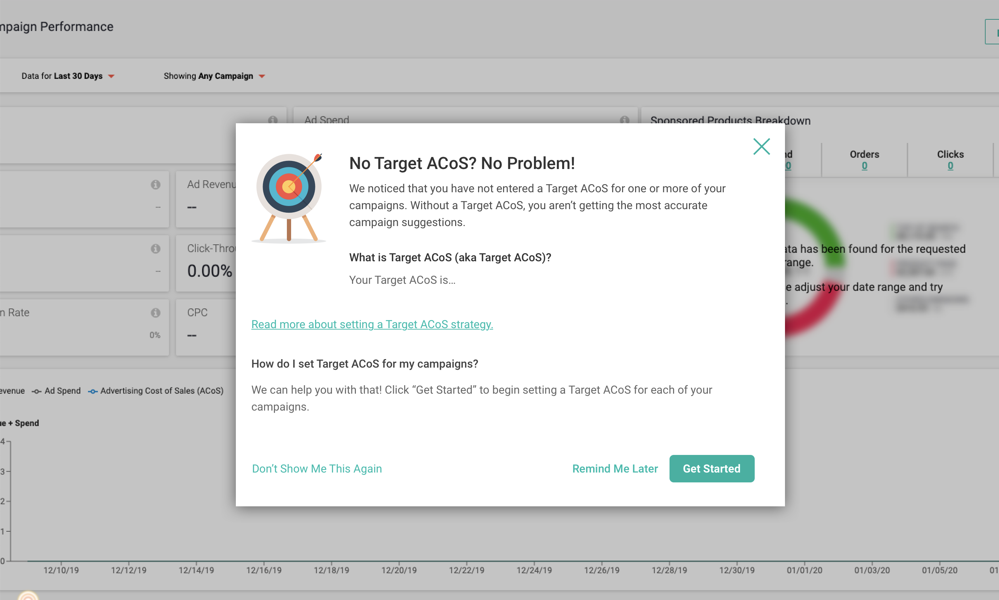

## React Exercise

Let's make a simple modal. We'll give you a mock, some CSS, and some guidelines. You spend just an hour or two to put together some code so we can talk through it in an interview. 

### General Preferences
- Write functional components when possible.
- Use Hooks!
- Adhere to basic web accessibility best practices.

### Mock

